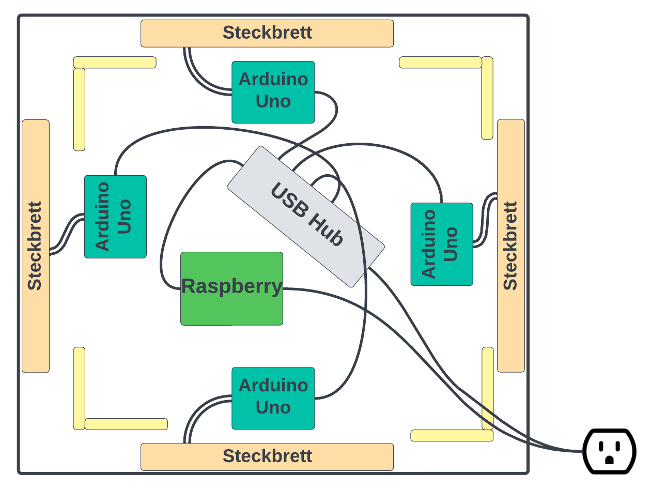
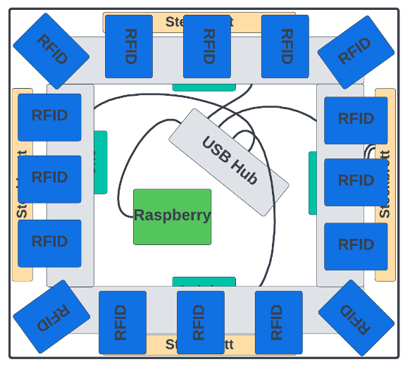

# RFID-Monopoly
## A smart board game powered by RFID, Golang and SvelteKit

## Demo Video
<a href="https://youtu.be/Dw4CXNqoKeE">Link to the demo video</a>

## Overview
This project combines 16 MFRC522 RFID sensors, 4 Arduino Uno and 1 Raspberry Pi to create an RFID base version of the popular board game Monopoly.

<label>Board of the prototype</label>
 

<label>Inside of the prototype</label>
 

<label>RFID sensor layer inside of the prototype</label>
 

<label>Real prototype</label>
 

## System design

The design consists of two main components. The physical board, where each sensor is read in a short interval. This part is mainly implemented on the Arduino Unos and the Raspberry Pi. The other main component is the Gamelogic. This represents the backend of the application and provides a REST interface via Golang.

Physical events, such as a player tag that is read, are sent from the Arduino to the Raspberry Pi via serial USB. A simple Python script maps these messages and creates a HTTP-Call to the backend.

In order to react on the relevant events in the backend, a websocket connection is established with the Webclient. This allows the SvelteKit application to show the corresponding dialog, when a user tag is read on an unowned field.

During this project, domain driven design was used to establish a domain:

The main part that triggers the state changes in the application is the TagReadEvent, which in the end updates the position of a user.
In the next picture, the UML Activity Diagram shows how domain driven design allows us to encapsulate game logic with the use of domain events.

The following deployment diagram shows where the components run.

If you're curious you can take a deep dive with this document:
[VM1.pdf](documentation%2FVM1.pdf)